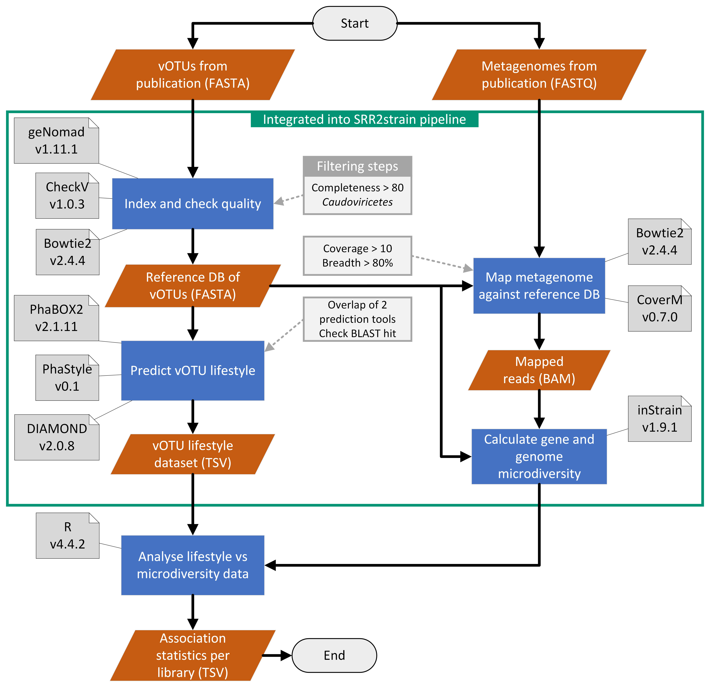

# SRR2strain pipeline

## Description
Software pipeline written in Snakemake, used for analysing microdiversity in metagenomics and viromics datasets.

## Installation
This package can be installed by cloning this repo. The yaml files for the conda environment are located in the workflow/envs directory. It is important to have snakemake and conda installed already.

## Usage
Workflow uses Snakemake to run various tools. It is advised to use the included bash script to prepare directories before running the pipeline.
To run the bash script, make sure you have cloned the repository and made the bash script executable (if needed). \
The bash script is located in the "scripts/scripts-bash" directory.
The bash script can be run using the following template parameters: \
`./SRRun2strain_setup.sh <destination_dir> <original_dir> <dataset_name>`

It is not strictly needed to run the bash script, although the output directories and necessary files will have to be created and copied manually.

General usage of the snakemake pipeline uses the following parameters: \
`snakemake --use-conda --cores 2 --configfile ["config-file"]`

Make sure that snakemake is installed on the host system before attempting to run the pipeline. The snakemake command has to be run from the top-level directory of the repository. `--cores 2` can be adapted to however many cores the host device has available for computation.
Jobs in the pipeline will scale to this setting automatically. For the `--configfile` flag, the .yml config file can be found in the "metadata" directory after running the bash script.

To get more information on running the pipeline and the tools/rules therein, clone the repository and run the `snakemake help --use-conda --cores 1` command. This will display information on the usage and rules in the pipeline.

## Pipeline overview

## Support
This package is solely build and maintained by Thomas de Bruijn. 
If you find any bugs or features lacking in the software, please consider contributing to this project. For more information, you can [mail the author](mailto:thomas.de.bruijn26@gmail.com).

## Roadmap
No features are planned yet.

## Authors and acknowledgment
Main author is Thomas de Bruijn, with special thanks to Anne Kupczok and Hilje Doekes for supervision.

## License
Project is licensed under the [GPL-3.0](https://choosealicense.com/licenses/gpl-3.0/) license.

## Project status
Project is currently under active development.